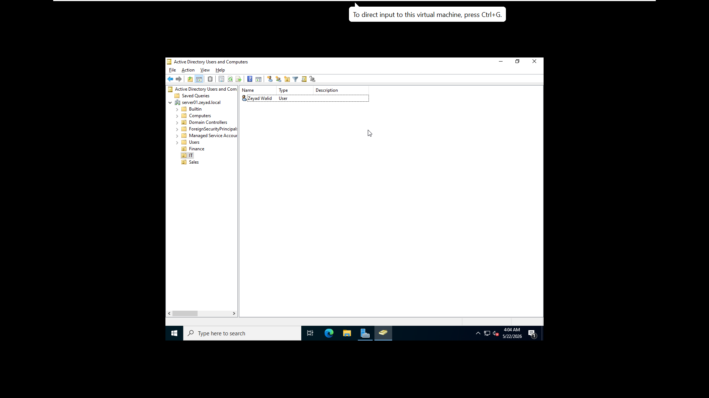
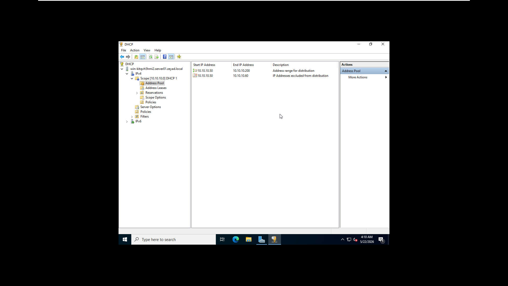
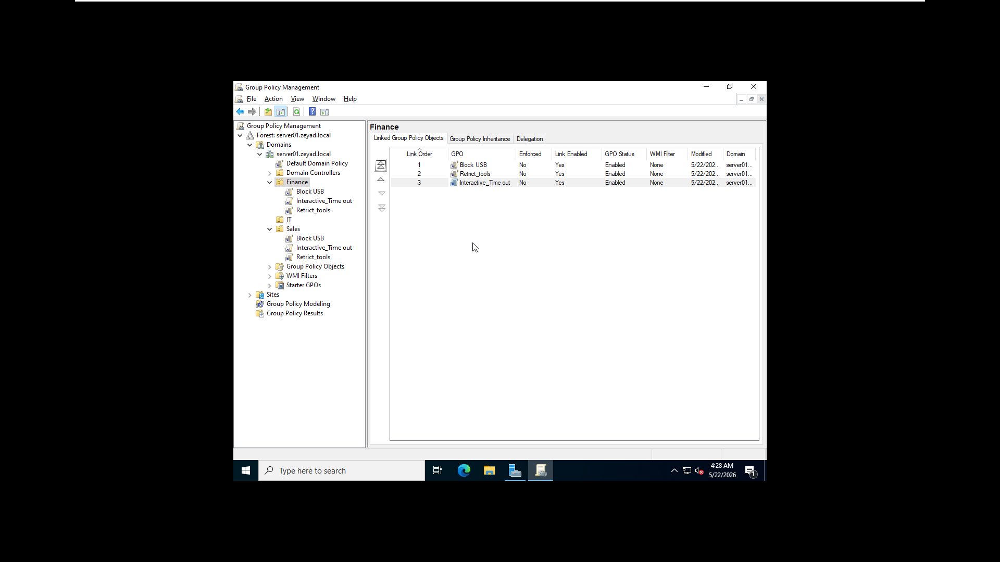

# Windows Server 2022 Environment & AD Provisioning Automation

## 1. Project Infrastructure Overview
This project documents the deployment of a centralized corporate network server using `Windows Server 2022 Standard (Desktop Experience)`. The deployment follows practical industry guidelines for Small-to-Medium Businesses (SMBs) to consolidate critical IT infrastructure roles onto managed hardware resources, minimizing cost while retaining complete control over organizational security boundaries.

### Network Configuration:
* **Domain Name:** `zeyad.local` (Server FQDN: `server01.zeyad.local`)
* **Server IP Address:** `10.10.50.10` (Static configuration within the Server Room Management Zone)
* **Client Environment:** Windows 10 Pro (Domain-joined)

---

## 2. Implemented Server Roles & Core Services

### Active Directory Domain Services (AD DS)
* Established the root domain controller (`zeyad.local`) to manage identities, workstation accounts, and authorization policies centrally.
* Organized directory infrastructure via a clean Organizational Unit (OU) schema designed around typical business functions: `IT`, `Finance`, and `Sales`.

### Dynamic Host Configuration Protocol (DHCP)
* Managed dynamic IPv4 addressing by creating production-ready scopes to prevent local address conflicts.
* **Network Scope:** `10.10.10.0/24`
* **Address Pool Range:** `10.10.10.50` to `10.10.10.200`
* **Active Exclusions:** `10.10.10.50` to `10.10.10.60` reserved exclusively for static infrastructure assets, ensuring dynamic leases begin from `10.10.10.61` onwards.

### Domain Name System (DNS)
* Configured local DNS zones integrated directly with AD DS to process internal forward and reverse name resolutions.
* Maps critical hosts and network components safely without public internet queries.

### File & Storage Services (Data Isolation)
* Deployed an internal network file share (`Company_Data`).
* Configured strict **NTFS and Share Permissions** to enforce security silos. The `Finance` repository remains completely hidden and restricted to accounting personnel, while general access is granted for public collaboration spaces.

---

## 3. Active Directory Provisioning Automation (Python)

To bypass tedious and error-prone manual user creation within the Active Directory Users and Computers GUI, user provisioning was completely automated using a lightweight Python script leveraging the `pyad` framework. 

The script reads structured department arrays, validates existence, and dynamically injects corporate employee credentials with predefined, system-compliant security passwords.

---

## 4. Endpoint Hardening via Group Policy Objects (GPOs)

To secure connected workstations and manage corporate desktop behavior, targeted **Group Policy Objects (GPOs)** were mapped directly to the active OUs:

1. **Mass Storage Block (USB Restriction):** Disabled read/write attributes for removable drives to combat data leakage (exfiltration) and safeguard against USB-initiated malware vectors.
2. **System Tools Restriction:** Prevented standard domain accounts from accessing `CMD.exe`, PowerShell scripts, and `Regedit` to mitigate privilege escalation and unauthorized environment modifications.
3. **Interactive Session Timeout:** Enforced a mandatory 5-minute idle screen saver timeout that locks the terminal automatically, ensuring physical asset protection.

## 5. Administrative Lab Validation Notes
* **Automated Identity Verification:** Verified that the directory structure and departmental users were correctly created in AD via script execution output.
* **Domain Integration:** Confirmed successful client-side connection via DHCP-assigned addressing and local DNS authentication checks.
* **Permission Enforcement:** Checked directory access; users in the `Sales` group receive a direct native "Access Denied" prompt when attempting entry into secure `Finance` paths.# windows-server
